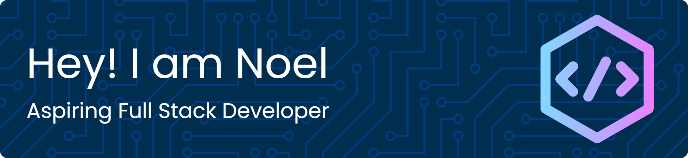

  

<h3 align="center">A passionate student learning how to code</h3>

  <a href="https://git.io/typing-svg">
  

  

  📫 How to reach me: <a href="mailto:blanco.noeljhumel1@gmail.com">blanco.noeljhumel1@gmail.com</a> | <a href="mailto:noeljhumel.blanco@1.ustp.edu.ph">noeljhumel.blanco@1.ustp.edu.ph</a>

  
  
  

  

<h3 align="center">🔗 Connect with me:</h3>

  
  
  

<h3 align="center">🧰 Languages and Tools:</h3>

  
  
  
  
  
  
  
  
  
  
  
  
  
  
  

  
  
  
  

  <h3 align="center">🏆 Additional Stats:</h3>

  
  
  
  

